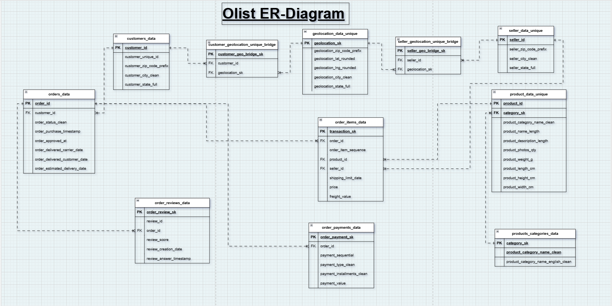
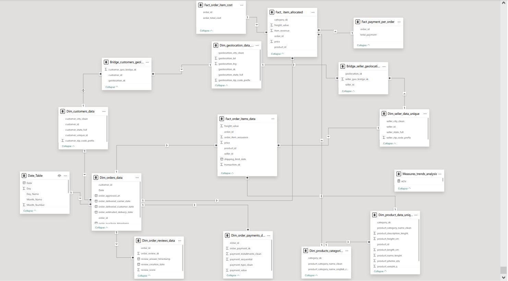
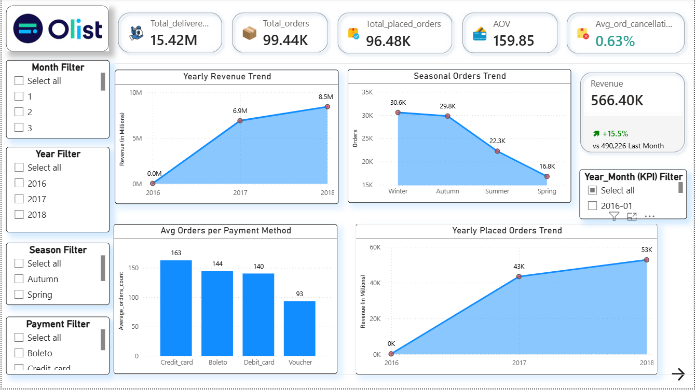

# 📊 Olist E-Commerce End-to-End Data Analysis  
**MySQL + Python + Power BI**

---

## 🔹 Project Summary
This project performs a complete analytical pipeline on the Brazilian Olist marketplace dataset.  
It demonstrates real-world data engineering + data analyst skills:

- ✔ Bulk data ingestion into MySQL  
- ✔ Data profiling & quality checks  
- ✔ Cleaning & transformation  
- ✔ Schema design in 3NF  
- ✔ Bridge table modeling  
- ✔ SQL analytics for business problems  
- ✔ Dashboard-ready datasets  

---

## 🛠 Tools Used
- MySQL  
- Python (pandas + SQLAlchemy)  
- Power BI  
- Excel (validation)  

---

# 🚀 Phase 1 — Data Loading (MySQL)

- Enabled `LOCAL INFILE`  
- Created staging tables  
- Loaded CSVs using bulk load  
- Disabled FK checks during ingestion  

### Tables Loaded
- customers  
- geolocation  
- orders  
- order_items  
- payments  
- reviews  
- products  
- sellers  
- category translation  

---

# 🔍 Phase 2 — Data Understanding

## Customers
- 99,441 rows  
- customer_unique_id repeats (actual customer)  
- State abbreviation issues  
- Orphan ZIPs detected  

## Geolocation
- 1M+ rows  
- Heavy duplicates  
- City inconsistencies  

## Orders
- 99,441 rows  
- Multiple lifecycle timestamps  
- Zero-date placeholders found  

## Payments
- Multiple payments per order  
- Voucher & installment inconsistencies  

## Reviews
- Large blank comment fields  
- No duplicates  
- Clean rating distribution  

## Order Items
- Item-level grain  
- Freight anomalies  

## Categories
- 71 unique categories  
- Surrogate key introduced  

## Sellers
- Orphan ZIP validation done  

---

# 🧹 Phase 3 — Data Cleaning & Transformation

- Standardized categorical values  
- Created clean columns  
- Converted zero-dates → NULL  
- Added primary keys  
- Added surrogate keys  
- Indexed major join columns  

---

# 🏗 Phase 4 — Schema Design

- Designed 3NF structure  
- Fact table at order-item level  
- Dimension tables for customers, products, sellers, categories  
- Bridge tables for geolocation mapping  

## Bridge Tables Created
- customer_geolocation_unique_bridge  
- seller_geolocation_unique_bridge  

### Purpose
- Resolve many-to-many ZIP relationships  
- Remove redundancy  
- Improve join accuracy  

## 🗺 ER Diagram

---

# 📈 Phase 5 — Business SQL Analysis

Twelve business problems solved:

1. Revenue trend over time  
2. Monthly order volume  
3. Popular product categories  
4. AOV by category & payment  
5. Active sellers over time  
6. Seller ratings vs sales  
7. Repeat customers & revenue share  
8. Product ratings impact  
9. Cancellation rate analysis  
10. Top selling products  
11. Payment method behavior  
12. Category-wise profit margin & profitability strategy  

---

# ⚡ SQL Concepts Demonstrated
- CTEs  
- Window Functions  
- Multi-level Aggregations  
- Bridge Table Modeling  
- Surrogate Keys  
- Index Optimization  
- Orphan Detection  
- Data Cleaning via SQL  

---

# 📊 Output Ready For
- Power BI dashboards  
- Retail analytics case studies  
- Interview portfolio  

## 🧩 Power BI Data Model
- Star schema built from normalized SQL tables.

## 📊 Dashboard Preview
### Dashboard:Order & Revenue Trend Analysis

### Dashboard:Stakeholder Analysis

---

## 👤 Author
**Naman Gupta**  
Aspiring Data Analyst | SQL | Power BI | Python
